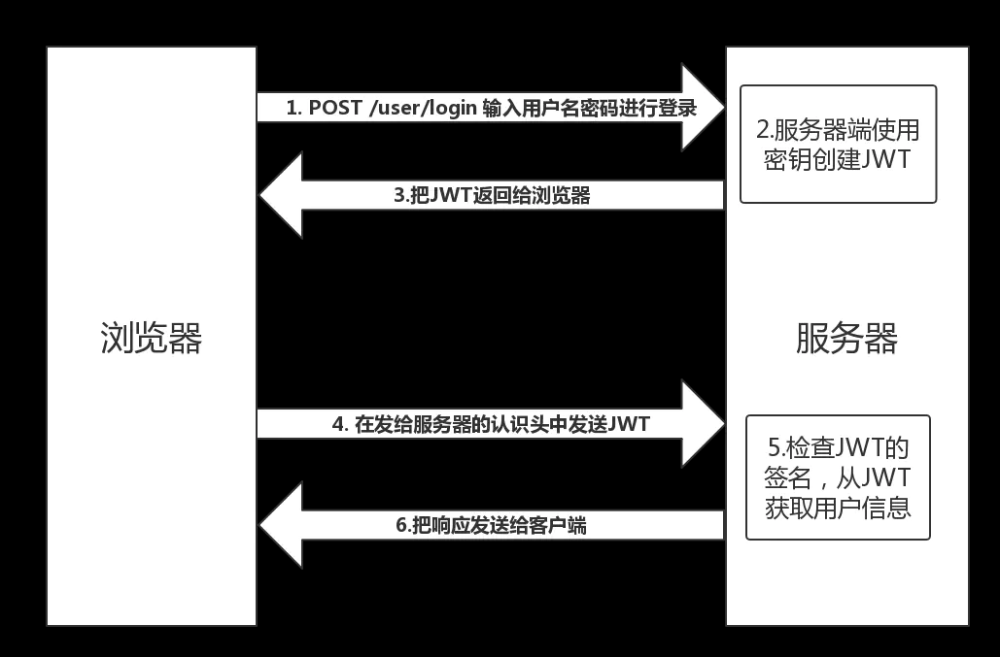

http无状态
记录用户状态的方式 cookie Session jwt token

## cookie 
储存在浏览器中，一般情况js和服务端都可修改，每个请求都会将浏览器的cookie带到服务端
常用的属性

1. name=value
键值对，设置 Cookie 的名称及相对应的值，都必须是字符串类型- 如果值为 Unicode 字符，需要为字符编码。- 如果值为二进制数据，则需要使用 BASE64 编码。

2. domain
指定 cookie 所属域名，默认是当前域名
3. path
指定 cookie 在哪个路径（路由）下生效，默认是 '/'。如果设置为 /abc，则只有 /abc 下的路由可以访问到该 cookie，如：/abc/read。
4. maxAge
cookie 失效的时间，单位秒。如果为整数，则该 cookie 在 maxAge 秒后失效。如果为负数，该 cookie 为临时 cookie ，关闭浏览器即失效，浏览器也不会以任何形式保存该 cookie 。如果为 0，表示删除该 cookie 。默认为 -1。- 比 expires 好用。
5. expires
过期时间，在设置的某个时间点后该 cookie 就会失效。一般浏览器的 cookie 都是默认储存的，当关闭浏览器结束这个会话的时候，这个 cookie 也就会被删除
6. secure
该 cookie 是否仅被使用安全协议传输。安全协议有 HTTPS，SSL等，在网络上传输数据之前先将数据加密。默认为false。当 secure 值为 true 时，cookie 在 HTTP 中是无效，在 HTTPS 中才有效。
7. httpOnly
如果给某个 cookie 设置了 httpOnly 属性，则无法通过 JS 脚本 读取到该 cookie 的信息，但还是能通过 Application 中手动修改 cookie，所以只是在一定程度上可以防止 XSS 攻击，不是绝对的安全

## session 
主体内容储存在服务器中，然后一个新请求介入的时候会生成一个SessionId设置到cookie中，下一次请求的时候通过cookie的方式带到服务器端，找到和其对应的信息内容。
### 过期时间
按照服务器设置的过期时间，当浏览器关闭后，SessionID在关闭页面的时候会被清理，但是服务器的session状态还在，只是下次请求的时候会给浏览器新的sessionID

## jwt 
有3个部分组成，分别是header.payload.signature

## token
和jwt相比，区别是token会去查数据库，
