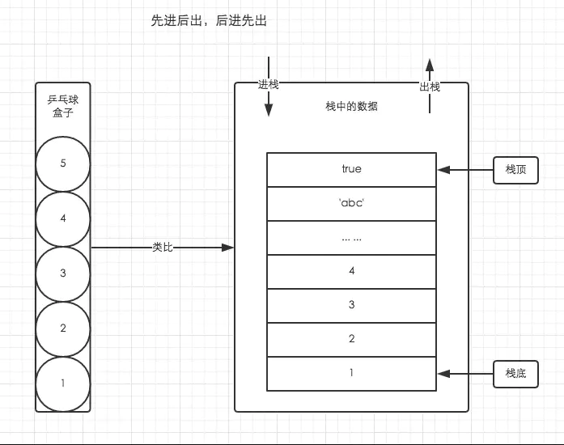
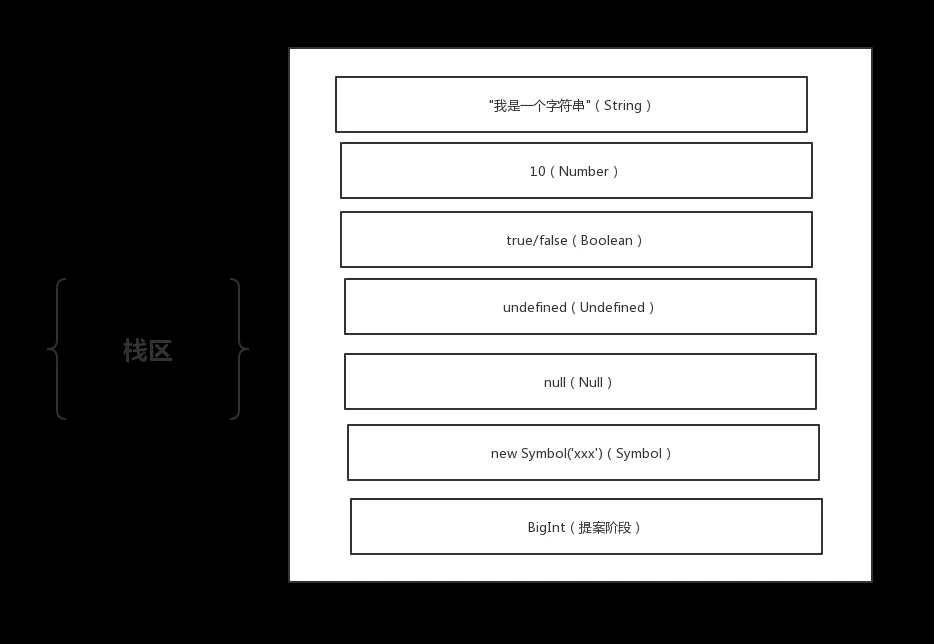

# 数据结构之栈
1、栈 是一种遵循 后进先出（LIFO） 原则的有序集合。新添加和待删除的数据都保存在栈的同一端栈顶，另一端就是栈底。新元素靠近栈顶，旧元素靠近栈底。
栈由编译器自动分配释放。栈使用一级缓存。调用时处于存储空间，调用完毕自动释放。
举个栗子：乒乓球盒子/搭建积木

2.2 基本数据结构的存储（存储栈）
javaScript中，数据类型分为基本数据类型和引用数据类型，基本数据类型包含：string、number、boolean、undefined、null、symbol、bigint这几种。在内存中这几种数据类型存储在栈空间，我们按值访问。原型类型都存储在栈内存中，是大小固定并且有序的。

2.3 执行栈（函数调用栈）
我们知道了基本数据结构的存储之后，我们再来看看JavaScript中如何通过栈来管理多个执行上下文。

程序执行进入一个执行环境时，它的执行上下文就会被创建，并被推入执行栈中(入栈)。
程序执行完成时，它的执行上下文就会被销毁，并从栈顶被推出(出栈)，控制权交由下一个执行上下文。

JavaScript中每一个可执行代码，在解释执行前，都会创建一个可执行上下文。按照可执行代码块可分为三种可执行上下文。

全局可执行上下文：每一个程序都有一个全局可执行代码，并且只有一个。任何不在函数内部的代码都在全局执行上下文。
函数可执行上下文：每当一个函数被调用时, 都会为该函数创建一个新的上下文。每个函数都被调用时都会创建它自己的执行上下文。
Eval可执行上下文：Eval也有自己执行上下文。

因为JS执行中最先进入全局环境，所以处于"栈底的永远是全局环境的执行上下文"。而处于"栈顶的是当前正在执行函数的执行上下文"，当函数调用完成后，它就会从栈顶被推出（理想的情况下，闭包会阻止该操作，闭包后续文章深入详解）。
"全局环境只有一个，对应的全局执行上下文也只有一个，只有当页面被关闭之后它才会从执行栈中被推出，否则一直存在于栈底"
看个例子：
    let name = '蜗牛';

    function sayName(name) {
        sayNameStart(name);
    }
    function sayNameStart(name) {
        sayNameEnd(name);
    }
    function sayNameEnd(name) {
        console.log(name);
    }
复制代码当代码进行时声明：

执行sayName函数时，会把直接函数压如执行栈，并且会创建执行上下文，执行完毕编译器会自动释放：

## 存储栈的应用

### LRU
LRU
在操作系统中， LRU 是一种常用的页面置换算法。其目的在于在发生缺页中断时，将最长时间未使用的页面给置换出去。
 要能知道使用最少的键值对 ！！！
     1.使用秘钥取数据时，就把当前的秘钥移动到数组的最后一项
2.数组的第一项就是使用长时间未使用的缓存数据

### 有效的括号